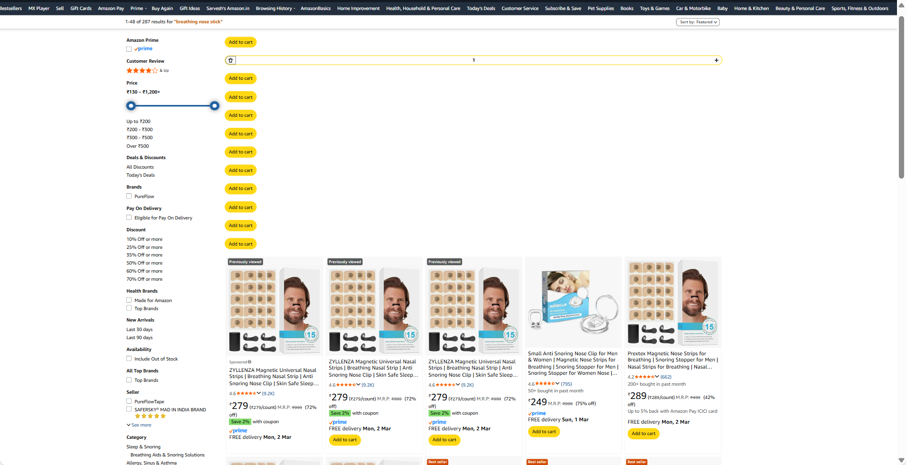

1. add option to get donation as buy me a cofee or support me. but for this which donation colletion account will i have to create?

2. sometimes  the items are not getting removed correctly, thier add_to_cart btn is left which seems really bad.

3. add another option of amazon's_choice, and limited_time_deal in filteration.

4. calculate a magic_score = rating * review_count and normalize in range of 0-100 and allow sorting based on this high-to-low.

5. remove low-high options from sorting for rating and review_count.

6. also allow sorting based on price, high-to-low and low-to-high.

----------------------------------------------------------

7. the listing doesn't show up after disabling the extention.

8. 